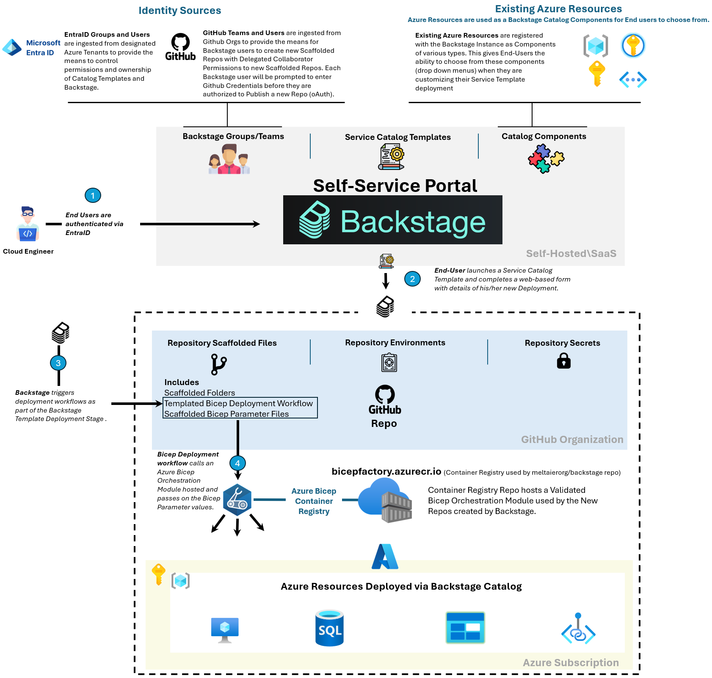

 <p align="center">
  
</p>

  - [Introduction](#introduction)
  - [Architecture](#architecture)
  - [Usage](#Usage)
    - [Prerequisites](#prerequisites)
  - [Homepage Customization](#homepage-customization)
  - [Imported Azure Components](#imported-azure-components)
  - [Auth Providers](#auth-providers)
    - [Custom Auth Logic](#custom-auth-logic)
  - [Permissions Model](#permissions-model)
  - [External Groups Ingestion](#external-groups-ingestion)
  - [Service Template Structure](#service-template-structure)
  - [Service Template Deployment Demo](#demo-service-template-deployment-demo)
  - [Final Thoughts](#final-thoughts)

# Introduction  

[](https://backstage.io/)

Persistent challenges such as slow deployment times and inconsistent configurations have long plagued Architects and Engineers alike. Addressing these issues demands an approach grounded in practical and flexible solutions. Enter Backstage, an open-source framework that is largely based on React for the frontend and express JS in the backend. Backstage empowers teams with self-service capabilities, enabling streamlined collaboration and faster iteration cycles, ultimately fostering a culture of autonomy and innovation within organizations. Leveraging Backstage's modular architecture and extensive community-maintained plugin ecosystem, infrastructure teams can begin to establish standardized workflows, Infrastructure/Software templates and Centralized visibility across different deployed Components . Backstage was initially popularized by Spotify and subsequently embraced by the DevOps and Platform Engineering communities for its robust capabilities in managing complex software ecosystems.

This repository hosts a customized tuned instance of Backstage that you can test-drive locally on your computer (instructions can be found [here](#Usage)) to help you understand and discover the many powerful features of Backstage. The repo also provides a Conceptual Architecture for coupling your Backstage Instance with Azure Verified Bicep Modules hosted in on Azure Container Registries to deploy Azure infrastructure, more information on this can be found [here](#Usage).

# Architecture
The Architecture used to setup the Conceptual Self-Service Platform is depicted in the following diagram.
At a high level the Conceptual Architecture that is put forward in this repo consists of the following key components and features:

1. A Backstage Instance pre-configured with EntraID, Github Auth Providers and Custom Auth Logic. Custom Auth logic is used for the Sign-In Resolvers in the backend. The custom logic limits access to the Backstage Instance by checking the Azure tenant in which the End User is signing on from, more details can be found  [here](#custom-auth-logic). 
Refer to the related sections for more information on each part of this solution.

2. Backstage Integration with EntraID and Github to ingest Organizational data from these systems (Groups and Teams respectively), this feature will come handy as we will be using the ingested data as lookup tables for delegating access to Components/Assets deployed by End-Users. More info can be found in [External Groups Ingestion](#external-groups-ingestion).

3. Registration of existing Organization Assets such as Subscriptions, Resource Groups, Keyvaults and Secrets. The registration of these components allows users to use them as lookup tables when customizing their deployments when launching template from the Backstage Service Catalog. Additional metadata to these resources are also added (annotations) to ensure we can fetch essnetial data (e.g Subscription ID, Tenant ID etc) from these Catalog components . More info can be found here [Imported Azure Components](#imported-azure-components). 

4. A highly customized Backstage Service Template for deploying VMs through Backstage, this template is designed to showcase and highlight the following key features

- oAuth Sign-in using Github Account to verify the logged in User has access to the Github Org they are deploying repos to

- the use of imported/registered components to use as lookup tables for creating drop-down options to end-users

- Nunjucks type templating for Repo Templated files and folders for the rendering of Dynamic folders, file names and file contents to a new Repo.

- the enforcement of key Github security related settings, including Branch Protection, delegated Collaborator role assignment to a Github Team selected by the user, and setup of Repo Environments and Secrets - all through a single Backstage Service Template .

- Integration with Github Actions (using a custom plugin) to not only trigger workflows after creation of a new Repo, but to also provide the user with a direct view of the workflow progress and logs, all from the Backstage UI.

5. An Azure Container Registry for hosting Verified Bicep Modules that the Github Workflows calls upon (triggered by backstage) to deploy Azure Resources. The sample Bicep Orchestration Module used by this repo can be found [here](https://github.com/meltaierorg/bicep-factory). You will need to create your own Azure Container Registry and publish the module to it , this is all covered in [Prerequisites](#Prerequisites)


 <p align="center">
  
</p>

# Usage

Backstage can be deployed on a laptop, a docker container , a k8 cluster and just about any Platform. This repo will focus on the functionality and security controls we can implement in Backstage, the instructions provided will help you deploy this Backstage instance on a Local Machine only. When running the Backstage instance locally you will basically be running the Backstage frontend and backend together on the same host (communicating via local TCP ports, 7007 and 8007 respectively). For the database, you would typically need to provide credentials to a Postgres DB backend (through app-config.yaml), however as we are running this Instance in a Dev environment, the configuration of this Backstage instance uses an in-memory postgres database, meaning that data won't persist anywhere once you shut down the Backstage Instance.

## Prerequisites

1. Install NPM. NPM is basic Node Package Manager that you will be using to install Yarn (see step 2).
Instructions for installation cab be found here  -> https://docs.npmjs.com/downloading-and-installing-node-js-and-npm

2. Install Yarn. Yarn is an advanced Node package manager tool that Backstage uses to download all the node packages needed by Backstage's Backend and Frontend (Yarn higher concurrency than NPM and more suited for larger and more complex Projects), it also helps you run the App locally using a simple command ```yarn dev```, the backend and front end are automatically launched by this simple command.
Instructions for installation cab be found here -> https://classic.yarnpkg.com/lang/en/docs/install/#windows-stable

3. You will need to setup your own **Bicep Orchestration Module** to be used by Backstage in the backend. For the demo shown in this repo, the Bicep Orchestration modules used can be found here https://github.com/meltaierorg/bicep-factory . Fork this repo and follow the instructions there to deploy an Azure Container Registry and publish the Bicep Orchestration Module to it.
To ensure you can pull Bicep Modules from this Registry, ensure any ServicePrincipal/Account used in testing has ```ACR Pull Premission``` on the respective registry. More details can be found [here](#prerequisites).

4. Create a Github PAT to enable Github integration (allows you to deploy scaffolded repos and run workflows)
After creating the token, export it as an Environment variable using the following key: 
- GITHUB_TOKEN <br />
More info can be found here - > https://backstage.io/docs/integrations/github/locations#token-scopes

5. Create a Github oAuth or Normal Github App. This App allows you to run an oAuth Workflow each time the End-User is deploying any Github related config, enforcing a higher level of Identity Security. Refer to the image below for the URLs you need to set for the Github oAuth App or Github App.
After you create the App, export the following keys and their values as Environment Variable Keys. Note: In this Demo, an oAuth App is used (if you want to use Github App instead, export the env vars that are outlined here instead https://backstage.io/docs/integrations/github/github-apps#including-in-integrations-config)

- AUTH_GITHUB_CLIENT_ID <br />
- AUTH_GITHUB_CLIENT_SECRET <br/>

More info -> https://backstage.io/docs/integrations/azure/org#app-registration <br/>

<p align="center">
  
</p>

6. Create an Azure Service Principal for Entra ID Auth so you can login to your local backstage instance via your EntraID credentials. If you are looking to test Azure deployments (via Backstage Service Templates) you can also use the same Service Principal for both cases (EntraID Org Data ingestion + Azure Deployments), you will need the Service Principal Secret handy as you will prompted to enter it in the Backstage Service Template deployment form, see [Service Template Deployment Demo](#demo-service-template-deployment-demo). Refer to the image below for the URLs you need to set for the Azure SPN.

 <p align="center">
  
</p>
 <p align="center">
  
</p>

After you create the SPN and any neccessary Azure Role Assignment (Contributor Role at Subscription Scope should be fine), export the credentials as Env Vars, export the following keys as below:
- AZURE_CLIENT_ID <br />
- AZURE_CLIENT_SECRET <br />
- AZURE_TENANT_ID <br />


7. To ensure Azure SSO works with you Azure tenant, you will need to edit a couple of Typescript files and replace any mention of the placeholder tenant below
Remove ***meltaier.onmicrosoft.com*** from the below files and replace it with your own Azure Tenant Domain
```
src\backstage-meltaier-org\packages\app\src\App.tsx
src\backstage-meltaier-org\packages\backend\src\index.ts
```
<p> You will also need to remove any references for Github Org or Azure Tenant **meltaierorg** and replace it with your own values.</p>

Congratulations! Now you are ready to run Backstage. 

## Deployment


To deploy this Backstage instance, simply clone this repo to your local machine, enter the root directory and type the following
```
 cd src\backstage-meltaier-org
```
```
yarn dev
```
Yarn will automatically open your browser (on http://localhost:7007/) and attempt to launch the backend and front end. You should be confronted with the SSO login screen as below:
 <p align="center">
  
</p>

# Homepage Customization
By default, a skeleton Backstage instance (if you were to start from scratch) does not come with a Homepage.
This Backstage instance does, and it also uses a customized Side Bar menu for quick access to essential components.

The Backstage Instance for this repo should look as below:
 <p align="center">
  
</p>

The Homepage contents can be customized from the following file

```
src\backstage-meltaier-org\packages\app\src\components\home\HomePage.tsx
```

If you also wish to customize the side bar menu edit the file below
```
src\backstage-meltaier-org\packages\app\src\components\Root\Root.tsx
```

then edit the side-bar menu by editing the SideBarItem elements. The Backstage module that we are using to render the front-end relies on existing React libraries which you can use to import a plethora of custom icons, as below:
```TypeScript
import MenuIcon from '@material-ui/icons/Menu';
import CloudIcon from '@material-ui/icons/Cloud';
import SecretIcon from '@material-ui/icons/VpnKey';
import GroupIcon from '@material-ui/icons/Group';
import DeploymentIcon from '@material-ui/icons/CloudUpload';
import SearchIcon from '@material-ui/icons/Search';

  export const Root = ({ children }: PropsWithChildren<{}>) => (
    <SidebarPage >

      <Sidebar>
        <SidebarLogo />
        <SidebarGroup label="Search" icon={<SearchIcon />} to="/search">
          <SidebarSearchModal />
        </SidebarGroup>
        <SidebarDivider />
        <SidebarGroup label="Menu" icon={<MenuIcon />}>
          {/* Global nav, not org-specific */}
          <SidebarItem icon={DeploymentIcon} to="catalog?filters%5Bkind%5D=template&filters%5Buser%5D=all" text="Catalog" />
          <SidebarItem icon={GroupIcon} to="catalog?filters%5Bkind%5D=group&filters%5Btype%5D=team&filters%5Buser%5D=all" text="Teams" />
          <SidebarDivider />
          
          <SidebarItem icon={CloudIcon} to="catalog?filters%5Bkind%5D=component&filters%5Btype%5D=subscription&filters%5Buser%5D=all" text="Subscriptions" />
          <SidebarItem icon={SecretIcon} to="catalog?filters%5Bkind%5D=component&filters%5Btype%5D=keyvault&filters%5Buser%5D=all" text="KeyVaults" />
          <SidebarItem icon={CategoryIcon} to="catalog?filters%5Bkind%5D=component&filters%5Btype%5D=resourcegroup&filters%5Buser%5D=all" text="Resource Groups" />
          <SidebarItem icon={LibraryBooks} to="catalog?filters%5Bkind%5D=component&filters%5Buser%5D=all" text="Components" />
          <SidebarDivider />

          
          <SidebarItem icon={CreateComponentIcon} to="create" text="Create..." />
          <SidebarScrollWrapper>
          
          </SidebarScrollWrapper>
        </SidebarGroup>
        <SidebarSpace />
        <SidebarDivider />
        <SidebarGroup
          label="Settings"
          icon={<UserSettingsSignInAvatar />}
          to="/settings"
        >
          <SidebarSettings />
        </SidebarGroup>
      </Sidebar>
      {children}
    </SidebarPage>
  );
```
Backstage also provides additonal guidance on Front end UI customization using the official UI  [Storybook](https://backstage.io/storybook/?path=/story/plugins-home-components-searchbar--custom-styles).


# Imported Azure Components

Importing Azure Resources is as easy writing a YAML manifiest file for them and then adding a reference to them through the app-config.yaml file. The app-config.yaml is the configuration file that Backstage uses to load Backstage configuration data during startup. During startup it attempts to load all Catalog components that you added to the app-config.yaml. Refer to the snippet below for a demonstration on how the YAML file config is translated to the Backstage front end.

Note that the configuration files are added directly to the **entities** folder in this repo for simplicity. However it is typically best practice to load them from an external system (e.g Github Repo ).
For Production its highly reccommend you either:
- Load the config files from an external repo, guidance can be found [Static Location Configuration Files](https://backstage.io/docs/features/software-catalog/configuration#static-location-configuration).
- Dynamically discover the configuration files, guidance can be found here [Dynamic Discovery of Configuration File](https://backstage.io/docs/integrations/github/discovery#configuration)

 <p align="center">
  
</p>


# Auth Providers

This Backstage instance leverages both Entra and Github as Identity Providers, but it is important to understand how the Auth is configured for the custom Backstage App in this Repo.

Entra Auth Provider is configured as the sole means of signing-in to Backstage using SSO, while Github Auth Provider is only used once the End-User is logged-in and attempts to publish a new Repo through a Service Template in Backstage. See below sections for configurations of each provider and important notes.

Guest level access is also currently enabled for this custom Backstage app , which allows you to login without credentials. In a production environment you will need to make sure this Provider is disabled (which you can do by omitting this provider from the **backend** and **auth** blocks in App-config.yaml) 

To setup Entra ID and Github auth, credentials are setup under **backend** and **auth** blocks in app-config.yaml file.
<p> If your configuration is successfull, it should appear as below.</p>
 <p align="center">
  
</p>

## Custom Auth Logic

To ensure the Backstage instance is locked down to one or more Azure tenants, custom Auth logic is added (typically referred to as a signInResolver logic in Backstage [Documentation](https://backstage.io/docs/auth/identity-resolver)).

During sign-in, Backstage grabs the profile details from the user logging in, and then it runs the custom logic under the *async signInResolver block* to decide whether the user should be issued a Backstage Token to access the Backstage App. If the user is authenticated and passes through the SignInresolver logic gate, Backstage will then form the Backstage User entity that the logged in user will assume, see ```const UserEntity``` code block. The custom code used for the signin resolver for this backstage instance is shown below

Location: ```src\backstage-meltaier-org\packages\backend\src\index.ts```
```typescript
const backend = createBackend();
import { createBackendModule } from '@backstage/backend-plugin-api';
import { stringifyEntityRef, DEFAULT_NAMESPACE } from '@backstage/catalog-model';
import { microsoftAuthenticator } from '@backstage/plugin-auth-backend-module-microsoft-provider';
import { githubAuthenticator } from '@backstage/plugin-auth-backend-module-github-provider';
import {
  authProvidersExtensionPoint,
  createOAuthProviderFactory,
} from '@backstage/plugin-auth-node';

const customAuth = createBackendModule({
  // This ID must be exactly "auth" because that's the plugin it targets
  pluginId: 'auth',
  // This ID must be unique, but can be anything
  moduleId: 'custom-auth-provider',
  register(reg) {
    reg.registerInit({
      deps: { providers: authProvidersExtensionPoint },
      async init({ providers }) {
        providers.registerProvider({
          // This ID must match the actual provider config, e.g. addressing
          // auth.providers.github means that this must be "github".
          providerId: 'microsoft',
          // Use createProxyAuthProviderFactory instead if it's one of the proxy
          // based providers rather than an OAuth based one
          factory: createOAuthProviderFactory({
            authenticator: microsoftAuthenticator,
            async signInResolver({ profile }, ctx) {
              if (!profile.email) {
                throw new Error(
                  'Login failed, user profile does not contain an email',
                );
              }
              // Split the email into the local part and the domain.
              const [localPart, domain] = profile.email.split('@');


              // Next we verify the email domain. It is recommended to include this
              // kind of check if you don't look up the user in an external service.
              if (domain !== 'meltaier.onmicrosoft.com') {
                throw new Error(
                  `Login failed, '${profile.email}' does not belong to the expected domain`,
                );
              }
            
              // By using `stringifyEntityRef` we ensure that the reference is formatted correctly
              const userEntity = stringifyEntityRef({
                kind: 'User',
                name: localPart,
                namespace: DEFAULT_NAMESPACE,
              });

              return ctx.issueToken({
                claims: {
                  sub: userEntity,
                  ent: [userEntity],
                },
              });
            },
          }),
        });
        providers.registerProvider({
          // This ID must match the actual provider config, e.g. addressing
          // auth.providers.github means that this must be "github".
          providerId: 'github',
          // Use createProxyAuthProviderFactory instead if it's one of the proxy
          // based providers rather than an OAuth based one
          factory: createOAuthProviderFactory({
            authenticator: githubAuthenticator,
            async signInResolver({ profile }, ctx) {
              // Split the email into the local part and the domain.
              const localPart = profile.displayName ?? '';
              if (!localPart) {
                throw new Error(
                  `GitHub user profile does not contain a username`,
                );
              }
              // By using `stringifyEntityRef` we ensure that the reference is formatted correctly
              const userEntity = stringifyEntityRef({
                kind: 'User',
                name: localPart,
                namespace: DEFAULT_NAMESPACE,
              });
              return ctx.issueToken({
                claims: {
                  sub: userEntity,
                  ent: [userEntity],
                }
              });
            }
          }),
        });
      },
    });
  },
});

backend.add(customAuth);
```
**Note**: Depending on your Organization you may need to edit the existing code provided for Custom Auth. 
<p>If you are also integrating many identity sources, you may need to consider developing your own User Profile Transformer code. For example, if you are ingesting
identities from different Azure Tenants, you may want to edit the namespace the user Entity is assigned to when they login to Backstage. The namespace provides the means to setup logical grouping of group entities ingested from different Identity Sources (default namespace is otherwise used - 'default').</p>

More info on namespaces can be found here [Entity References](https://backstage.io/docs/features/software-catalog/references/)

For more info on setting up your custom transformer logic for users signing in as well as the groups being ingested:

[User Profile Transformers](https://backstage.io/docs/auth/identity-resolver#profile-transforms)

[EntraID Org Data Transformer](https://backstage.io/docs/integrations/azure/org#using-custom-transformers)

[Github Org Data Transformer](https://backstage.io/docs/integrations/github/org)

# Permissions Model
There is currently no permissions model setup in this Backstage instance so all users can see any Service Templates and all entities in Backstage. However in 2023 Spotify released a promising no-code UI-based RBAC plugin that allows you to set granular data/actions permissions based on Group Memberships, for more info on how to setup and install go to the [Spotify's Backstage Website](https://backstage.spotify.com/docs/plugins/rbac/setup-and-installation).

## Logon Welcome Message
If you wish to edit the home page you need to edit the main Application file (App.tsx)

<p> See below snippets as a guide</p>

 <p align="center">
  
</p>
 <p align="center">
  
</p>


# External Groups Ingestion
The Backstage instance in this repo is configured to ingest User and Group/Teams from designated Entra/Github Org as shown below. The Github/EntraID Catalog Backstage provider automatically ingests groups, users and group memberships.

 <p align="center">
  
</p>

Note: As mentioned in [Custom Auth Logic](#custom-auth-logic), if you are ingesting identies from multiple Azure tenants you may need to consider using a custom Transformer to ensure Identities are grouped under a specific Backstage Namespace when they are bieng ingested.

# Service Template Structure

The backstage instance in this repo contains a Demo Service Template to showcase some of the powerful templating features you can use to scaffold any repo.

The demo service template folder **azure-infra** can be found in :
```
src\backstage-meltaier-org\serviceTemplates\
```
The structure of the template is as below:
 <p align="center">
  
</p>

<p>Let's break down the purpose of each file in this folder:</p>

---

## <p>file: template.yaml</p>
**Location:**<p>rc\backstage-meltaier-org\serviceTemplates\azure-infra\template.yaml</p>

---

**Description:**<p> This template file is the main configuration file that Backstage uses to collect Parameters from the user and later uses the values provided to render a scaffolded repo.
There are 3 x main stages for each Template file:</p>

**Stage 1:** Parameters Collection Stage
<p>In this stage the user is prompted to enter values for their deployment following the rules of the template.</p>

**Stage 2:** Template Execution Stage
<p>After the user provides all the neccessary inputs, Backstage runs the configured steps under the template.</p> 

One of the key steps in the execution is fetching the template files from the content subfolder within the template folder, and then later publishing the rendered files to the designated repo defined by the user. See highlighted steps below and notice how we are feeding the parameters to the **fetch:template** step. This is the step in which Backstage renders the Repo Files before publishing them in the next step (**publish:github**)

 <p align="center">
  
</p>

**Stage 3:** Component Registration Stage
<p>After all the template execution steps are completed, this crucial step provides the means for Backstage to register the deployed component and add it to its catalog .</p> 

<p>In this example the catalog-info.yaml is expected to be at the root of the repository (content folder) but it can be placed anywhere.</p>

```yaml
    - id: register
      name: Register
      action: catalog:register
      input:
        repoContentsUrl: ${{ steps['publish'].output.repoContentsUrl }}
        catalogInfoPath: '/catalog-info.yaml'
```

---

## <p>file: catalog-info.yaml</p>
**Location:**<p>src\backstage-meltaier-org\serviceTemplates\azure-infra\content\catalog-info.yaml</p>

---

**Description:**<p> This file can be considered as the unique identity for the specific component the end-user deployed, it is also meant to hold metadata about the component</p>
Essential Metadata can be static or dynamic. In most cases you would want to have both types of Metadata. See example catalog-info in this repo. 
Note: the *dump* nunjucks filter found in ```${{ values.appName | dump }}``` is effectively used to ensure any value injected is surrounded by double quotes, this can be helpful if you are dealing with special characters.

```yaml
apiVersion: backstage.io/v1alpha1
kind: Component
metadata:
  name: ${{ values.appName | dump }}
  description: ${{ values.description | dump }} 
  annotations:
    github.com/project-slug: ${{ values.repoSlug }}      ##This annotation is required to ensure CI-CD integration with Github works post deployment
spec:
  type: azure-infra
  owner: group:grp-platform-team                        ## Owner of this example component is assigned statically, but typically you would want this to be dynamic e.g ${{ values.owner }
  lifecycle: experimental
  subcomponentOf: ${{ values.subscription }}

```
Just like all the other files in the template folder, this file is rendered through Backstage's templating engine and the dynamic values are injected to this file, before getting published to a Repo, which later gets accessed by Backstage remotely(during **publish:github** step) to register the component in Backstage Catalog.

---

## <p>file: {{values.appName}}.bicepparam</p>
**Location:**<p>src\backstage-meltaier-org\serviceTemplates\azure-infra\content\workload\${{values.subscription}}\${{values.appName}}\${{values.appName}}.bicepparam</p>

---

**Description:**<p> This file as the syntax implies is dynamically named after the App Name.</p>
This is the parameter file that we will be using to deploy Azure Resources through an Orchestration module hosted in an Azure Container Registry.


```bicep
using '${{ values.BicepRegistry}}'
//////////////////////////////
/////// PARAMETERs //////////
/////////////////////////////

// Define Az Deployment metdata 
param applicationName  = '${{ values.appName }}'             //used for tagging          

param owner = 'github-team-${{ values.owner }}'            //used for tagging

param environmentTagValue = '${{ values.environment }}'       //used for tagging               

param primaryLocation  = '${{ values.region }}'             

param resourceGroup  = '${{ values.resourceGroup }}'

param VMGroup01Count = ${{ values.count }}                             
param VMGroup01VMPrefix  = '${{ values.vmprefix }}'                 
param VMGroup01Size = '${{ values.size }}' 
param secretsKeyVaultName = '${{ values.keyVaultName }}'
param vmAdminPasswordSecret = '${{ values.vmAdminBreakGlassSecret }}'
param secretsVaultResourceGroup = '${{ values.keyvaultResourceGroup }}'         
param subnetNameVMGroup01 = '${{ values.subnet }}'    
param VMGroup01ASGPrefix = '${{ values.appName }}' 

```

To help you visualize the templating proccess refer to the snippet below that shows how User Input values are substituted:
 <p align="center">
  
</p>

---

## <p>file: deploy-bicep.yml</p>
**Location:**<p>src\backstage-meltaier-org\serviceTemplates\azure-infra\content\.github\workflows\deploy-bicep.yml</p>

---

**Description:**<p> This file is the Github Workflow that Backstage will trigger and pass workflow params to.</p>
As Github Workflow files uses similar syntax for templating e.g ${{secrets.subscriptionID}}. This is a file we must exclude from the Backstage templating engine to ensure the Github Workflow file is unchanged when it is published to a new Repo, this is already done in our template using the copyWithoutRender clause, as below

**file**: src\backstage-meltaier-org\serviceTemplates\azure-infra\template.yaml
```yaml
    - id: fetch-base
      name: Fetching Infrastructure Repository Template
      action: fetch:template
      input:
        url: ./content
        copyWithoutRender: 
          - '.github/workflows/deploy-bicep.yml'
```
# Service Template Deployment Demo
**This section will cover the End-User end-to-end flow from choosing a template to deploying it.**

---
Backstage Templates can be discovered and selected under 'Catalog'. Users can also search Catalog Service Templates by their Type, name etc.

 <p align="center">
  
</p>

---


In this dialog box, notice how the *catalogFilter* option is set for the *owner* parameter to provide lookup functionality. This allows the End-User to delgate permissions for the new Repo to a Github Team. In the later sections you will see how we are then passing this parameter value to set the provided Github Team as Repo Collaborators. 

 <p align="center">
  
</p>

---
 <p align="center">
  
</p>

---
In this Dialog box where you need to set the Repo Name for the respective Github Org, oAuth is required as *requestUserCredentials* is set, see the Yaml file. This will trigger a login dialog for the user to enter their credentials before continuing.


 <p align="center">
  
</p>

---
In this dialog box, the Bicep Registry, associated Repo and its version are selected by the user. Consider offering different versions in cases where you need to trial new 'beta' version of your Bicep modules.


 <p align="center">
  
</p>

---
In this dialog box, the end-user is expected to provide a Service Principal secret to setup their Repos Secrets. This is just an example of how you can handle secrets in Backstage, your implementation of secrets management may differ depending on your security requirements. 

 <p align="center">
  
</p>

---
 <p align="center">
  
</p>

---
Once the End-User has progressed to the final confirmation dialog box and clicked **Create**, they can sit back and let Backstage do its magic.
 <p align="center">
  
</p>

---

Opening the newly deployed Component in Catalog, provides a CI-CD pane that pulls any information of current and historical deployments in that repo.

 <p align="center">
  
</p>

---

 <p align="center">
  
</p>


# Final Thoughts

In conclusion, Backstage offers a flexible framework for streamlining operations, providing a centralized platform for managing services, infrastructure and enabling efficient collaboration across teams. By leveraging Azure Bicep Modules, you effectively standardize your deployments , ensuring consistency, security and reliability in your infrastructure. However, it is important to recognize that implementing and maintaining such a solution requires dedicated expertise and resources (especially in Typescript). For teams seeking additional support in their Backstage journey, there are a several SaaS providers that offer this type of service.


**Author:** Mohamed El Taier

**Date** 11/06/24
